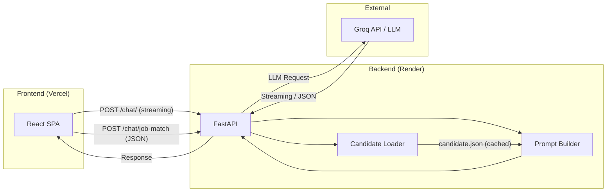
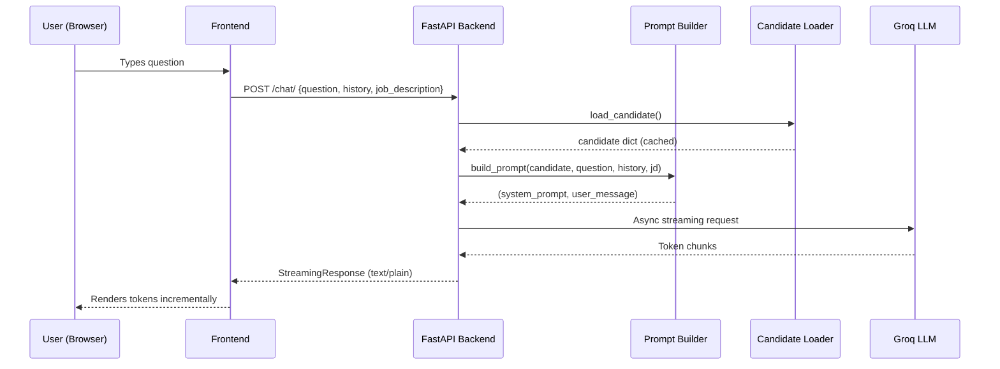
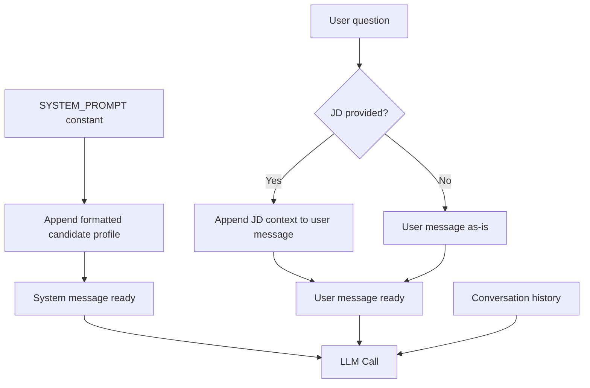
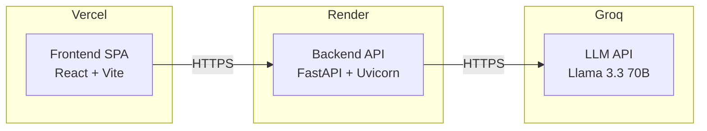

# Architecture — Jyoti.AI Portfolio

## High-Level Overview

Jyoti.AI is a two-tier web application: a **React SPA** (frontend) communicates with a **FastAPI backend** that orchestrates LLM calls via the Groq API. The system is designed for a single-purpose use case — representing one candidate to recruiters through conversational AI and structured job matching.



---

## Folder Structure

```
ai-portfolio-chatbot/
├── backend/
│   ├── app/
│   │   ├── data/
│   │   │   └── candidate.json          # Authoritative candidate profile
│   │   ├── models/
│   │   │   └── chat.py                 # Pydantic request schemas
│   │   ├── routes/
│   │   │   └── chat.py                 # API endpoints (chat + job-match)
│   │   ├── services/
│   │   │   ├── candidate_loader.py     # JSON loader with lru_cache
│   │   │   ├── llm.py                  # Async Groq client wrapper
│   │   │   └── prompt_builder.py       # System/user prompt construction
│   │   ├── __init__.py
│   │   ├── config.py                   # Settings & env var parsing
│   │   ├── main.py                     # FastAPI app, CORS, lifespan
│   │   └── prompts.py                  # System prompt definitions
│   ├── .env.example
│   ├── pyproject.toml
│   └── requirements.txt
├── frontend/
│   ├── src/
│   │   ├── components/
│   │   │   ├── Chat/                   # ChatBox, ChatMessage, PromptChips
│   │   │   ├── JobMatch/               # JobContextPanel, JobMatchBox
│   │   │   ├── Hero/                   # Hero section
│   │   │   ├── Navbar/                 # Fixed navigation
│   │   │   ├── Projects/               # Project cards
│   │   │   ├── Skills/                 # Skill categories
│   │   │   ├── Education/              # Academic timeline
│   │   │   ├── Contact/                # Contact methods
│   │   │   └── UI/                     # Shared: GlassCard, AnimatedSection, etc.
│   │   ├── hooks/
│   │   │   ├── useChat.js              # Chat state + streaming logic
│   │   │   ├── useSpeechRecognition.js # Voice input (STT)
│   │   │   └── useSpeechSynthesis.js   # Audio response (TTS)
│   │   ├── services/
│   │   │   └── api.js                  # Backend HTTP client
│   │   ├── utils/
│   │   │   └── analytics.js            # Local analytics tracker
│   │   ├── App.jsx                     # Root layout
│   │   ├── index.css                   # Design tokens + print styles
│   │   └── main.jsx                    # React entry point
│   ├── index.html                      # HTML shell + SEO meta
│   ├── package.json
│   └── vite.config.js
├── .gitignore
├── ARCHITECTURE.md                     # ← This file
├── API.md                              # API reference
├── DEPLOYMENT.md                       # Deployment guide
└── README.md
```

---

## Backend Architecture

### Request Flow



### Key Design Decisions

| Decision | Rationale |
|---|---|
| **Static candidate JSON** | Single source of truth; no database needed for a portfolio |
| **`lru_cache` on loader** | Candidate data never changes at runtime — read once from disk |
| **System prompt + user message separation** | Proper LLM message role separation improves response quality |
| **JD in user message (not system)** | Prevents redundant token usage when JD is sent with every turn |
| **Streaming via async generator** | Real-time token delivery matching modern AI interfaces |
| **JSON mode for job-match** | Structured output via Groq's `response_format` parameter |

### Prompt Pipeline



### Conversation Memory

Memory is **client-side**: the frontend maintains the full message array and sends it as `history` with each request. The backend is stateless — it receives the history, builds the prompt, and forwards everything to the LLM.

**Token optimization**: The initial greeting message is filtered out of history before sending to avoid wasting tokens on a static string.

---

## Frontend Architecture

### State Management

The application uses **React hooks** for all state:

| Hook | Responsibility |
|---|---|
| `useChat` | Messages, input, streaming, abort controller |
| `useSpeechRecognition` | Voice-to-text input |
| `useSpeechSynthesis` | Text-to-speech for AI responses |

State lives in `App.jsx` (job description, report visibility) and is passed down via props. No global state library is needed for this scale.

### Component Hierarchy

```
App
├── Navbar
├── Hero
├── JobContextPanel
├── ChatBox / JobMatchBox (toggled)
│   ├── ChatMessage (per message)
│   └── PromptChips (initial state)
├── Projects
├── Skills
├── Education
└── Contact
```

---

## Deployment Architecture



| Layer | Platform | Build Command | Start Command |
|---|---|---|---|
| Frontend | Vercel | `npm run build` | Static serve from `dist/` |
| Backend | Render | `pip install -r requirements.txt` | `uvicorn app.main:app --host 0.0.0.0 --port $PORT` |

### Environment Variables

| Variable | Required | Where | Purpose |
|---|---|---|---|
| `GROQ_API_KEY` | ✅ | Backend | LLM API authentication |
| `MODEL_NAME` | ❌ | Backend | LLM model (default: `llama-3.3-70b-versatile`) |
| `FRONTEND_URL` | ❌ | Backend | CORS allowed origins (comma-separated) |
| `DEBUG` | ❌ | Backend | Enables `/docs` and verbose logging |
| `VITE_API_URL` | ✅ | Frontend | Backend API base URL |

---

## Future Scalability

| Area | Current | Recommended Next Step |
|---|---|---|
| **Rate limiting** | None | Add `slowapi` middleware (in-memory or Redis-backed) |
| **Candidate data** | Static JSON | Database-backed profiles for multi-tenant support |
| **Authentication** | None | API key or OAuth for recruiter sessions |
| **Analytics** | localStorage | Server-side analytics (PostHog, Plausible) |
| **Caching** | lru_cache | Redis for shared state across workers |
| **Testing** | None | Pytest (backend), Vitest (frontend) |
